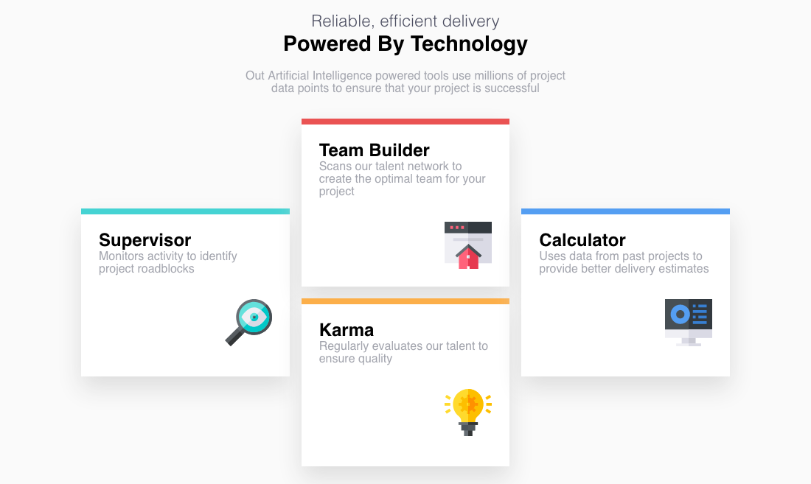

# Frontend Mentor - Four card feature section solution

This is a solution to the [Four card feature section challenge on Frontend Mentor](https://www.frontendmentor.io/challenges/four-card-feature-section-weK1eFYK).

## Table of contents

- [Overview](#overview)
  - [The challenge](#the-challenge)
  - [Screenshot](#screenshot)
  - [Links](#links)
- [My process](#my-process)
  - [Built with](#built-with)
  - [What I learned](#what-i-learned)
  - [Useful resources](#useful-resources)
- [Author](#author)

## Overview

### The challenge

Users should be able to:

- View the optimal layout for the site depending on their device's screen size

### Screenshot

### Links

- [Solution URL](https://github.com/geeky-amat/four-card-feature-section-master)
- [Live Site URL](https://geeky-amat.github.io/four-card-feature-section-master/)

## My process

### Built with

- Semantic HTML5 markup
- CSS custom properties
- Flexbox
- CSS Grid
- Mobile-first workflow
- [React](https://reactjs.org/) - JS library
- [Styled Components](https://styled-components.com/) - For styles

### What I learned

- Learnt to work with CSS grid
- Learnt to work with SVG
- Learnt to use Box-Shadow
- [Learnt that even React components can be passed as props](https://reactjs.org/docs/composition-vs-inheritance.html)

### Useful resources

- [How do I add color to my SVG in React](https://stackoverflow.com/questions/54519654/how-do-i-add-color-to-my-svg-image-in-react) - The discussion here gives different ways of using SVG in a react application and also lists ways to change its color.

## Author

- Frontend Mentor - [@geeky-amat](https://www.frontendmentor.io/profile/geeky-amat)
- Twitter - [@GeekyAmat](https://www.twitter.com/GeekyAmat)